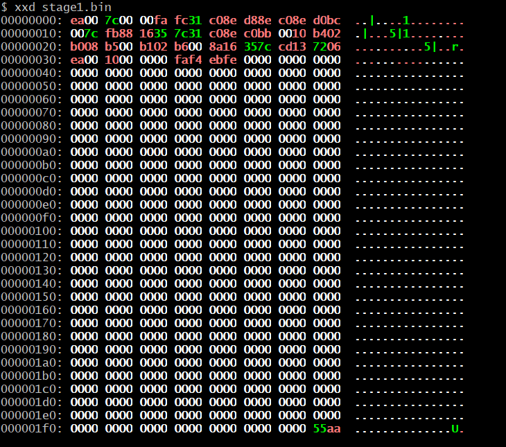

# flat-binary-bootloader
Rewrite of my STRIX bootloader as a pure flat binary, using raw machine code only—no ELF, no object formats, and no linker.

## Analysis with xxd to verify that it is spelled correctly.

# License

GNU General Public License v3.0
